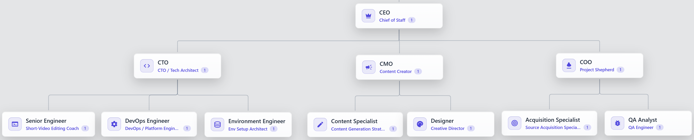
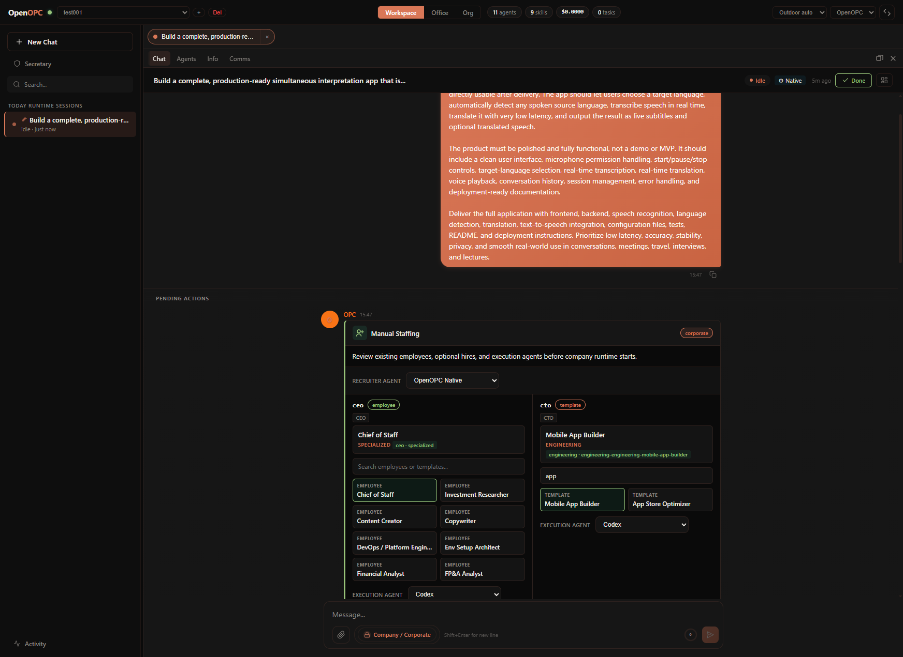
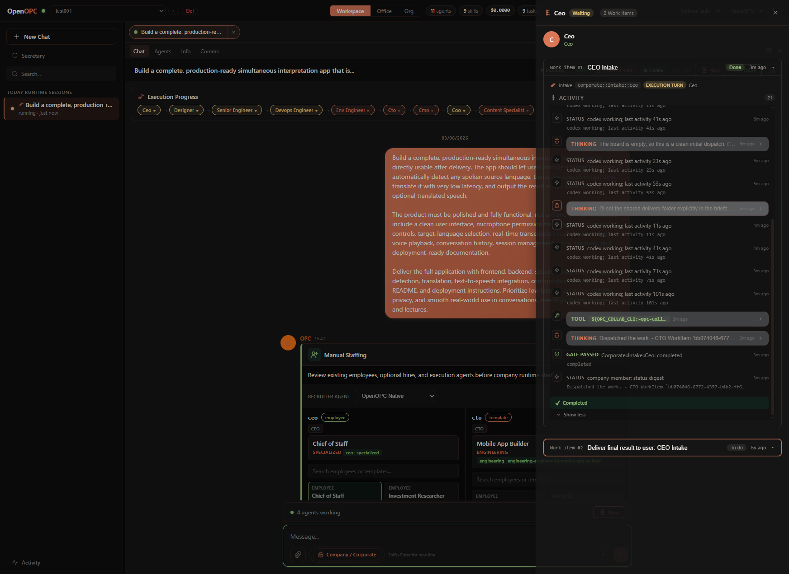
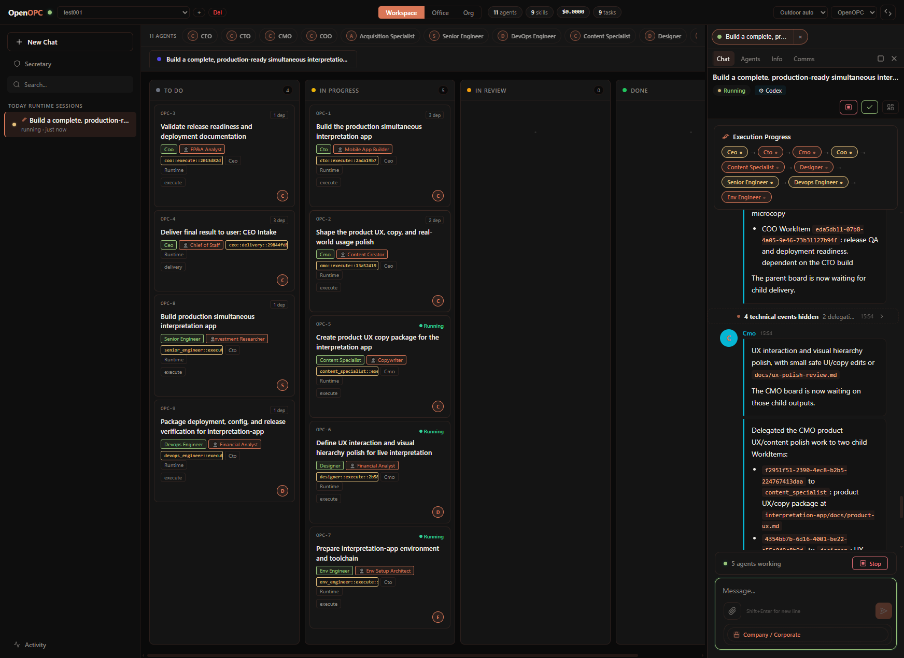
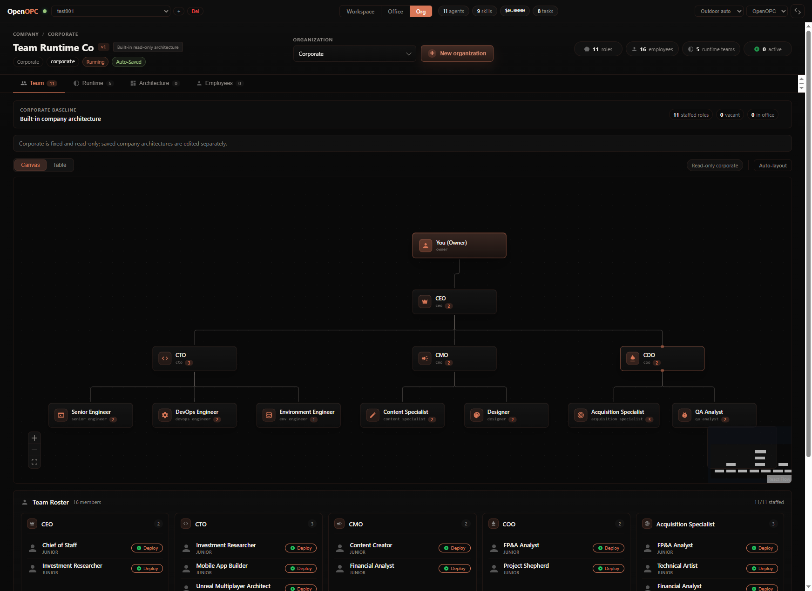
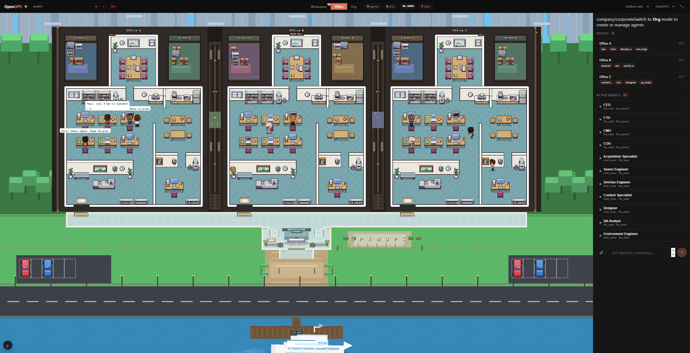

<h1 align="center" style="font-size: 1.75em;">OpenOPC: Build Your Personal AI-Native Company — Self-Built, Self-Run, Self-Grown</h1>

<p align="center">
  <b>English</b> | <a href="README.zh-CN.md">简体中文</a>
</p>

🏗️ **Self-Built** — Fully automated to recruit role-specific AI employees and build the org.

⚙️ **Self-Run** — Fully automated to assign tasks, drive handoffs, and keep moving toward your goal.

🌱 **Self-Grown** — Learns from every task, builds organizational memory, always delivers smarter.

<p align="center">
  
  
  
  
  <a href="https://github.com/HKUDS/.github/blob/main/profile/README.md"></a>
  <a href="https://github.com/HKUDS/.github/blob/main/profile/README.md"></a>
</p>


## Table Of Contents

- [When To Use OpenOPC](#when-to-use-openopc)
- [Demos](#demos)
- [How OpenOPC Works](#how-openopc-works)
- [Quick Start](#quick-start)
- [Office UI Guide](#office-ui-guide)
- [CLI Guide](#cli-guide)
- [Configuration](#configuration)
- [Ecosystem And Sharing](#ecosystem-and-sharing)
- [Roadmap](#roadmap)
- [Acknowledgements](#acknowledgements)

## When to Use OpenOPC

**OpenOPC** covers nine core verticals — from AI development and software engineering to finance, sales, media, e-commerce, and education. Whatever the industry, OpenOPC assembles the right team and delivers end-to-end.

<table>
  <tr>
    <td width="33%" valign="top">
      <br><strong>🤖 AI Tech & Research</strong>
      <br><sub>Model training & evaluation, Agent development, LLM apps & AI infrastructure</sub>
    </td>
    <td width="33%" valign="top">
      <br><strong>💻 Software Development</strong>
      <br><sub>Android apps, SaaS MVPs, websites, mini programs & game development</sub>
    </td>
    <td width="33%" valign="top">
      <br><strong>📈 Financial Investment</strong>
      <br><sub>Investment memos, market maps, due diligence & IC decision packages</sub>
    </td>
  </tr>
  <tr>
    <td valign="top">
      <strong>🚀 Sales Growth</strong>
      <br><sub>Outbound sales, deal strategy, proposals & channel expansion</sub>
    </td>
    <td valign="top">
      <strong>🎬 Content & Media</strong>
      <br><sub>Video production, short-form content, scripts, storyboards & multi-platform cuts</sub>
    </td>
    <td valign="top">
      <strong>🤝 Industry Assistants</strong>
      <br><sub>Copilots for support, real estate, legal intake, HR onboarding, retail</sub>
    </td>
  </tr>
  <tr>
    <td valign="top">
      <strong>🧾 Accounting & Finance</strong>
      <br><sub>Bookkeeping, financial reporting, tax compliance, budgeting & risk review</sub>
    </td>
    <td valign="top">
      <strong>🛍️ Brand & E-commerce</strong>
      <br><sub>Brand planning, product selection, store ops, user growth & retention</sub>
    </td>
    <td valign="top">
      <strong>🎓 Education & Training</strong>
      <br><sub>Curriculum design, knowledge base, learner management & content production</sub>
    </td>
  </tr>
</table>

## Demos

<table>
  <tr>
    <td width="33%" align="center" valign="top">
      <a href="https://youtu.be/XqQeTt6XvPQ">
        
      </a>
      <br><br>
      <strong>🎬 Video Production</strong>
    </td>
    <td width="33%" align="center" valign="top">
      <a href="https://drive.google.com/drive/folders/1T1Nl6CCE-cmbGy6sKrYML7_UnP8XID88?usp=drive_link">
        
      </a>
      <br><br>
      <strong>📈 Investment Research</strong>
    </td>
    <td width="33%" align="center" valign="top">
      <a href="https://youtu.be/SVc9BvE5ohY">
        
      </a>
      <br><br>
      <strong>🎮 Game Prototype</strong>
    </td>
  </tr>
</table>

## How OpenOPC Works

OpenOPC assembles a AI company around complex, real-world tasks — through three tightly coupled mechanisms: **Self-Built** staffs the organisation, **Self-Run** executes the work, and **Self-Grown** learns from the outcome.

<p align="center">
  
</p>

**1. Self-Built — Staffing the Organisation**

Before any work begins, the right people must be in place. Given a goal, OpenOPC:

- 🌿 Drafts the org chart — deriving the roles and reporting structure the task demands.
- 🎯 Fills each role — a recruiter agent chooses between reusing an existing employee (shaped by prior projects) and onboarding a fresh hire from the talent pool.

💡 Experienced employees carry accumulated context; fresh hires offer a clean slate when a role demands it.

**⚙️ 2. Self-Run — Executing the Work**

With the team assembled, Self-Run orchestrates its members toward a finished deliverable. The central challenge is not raw execution but efficient collaboration under uncertainty, which manifests in two distinct problems.

🔀 Dynamic collaboration orchestration. Real work cannot be fully planned upfront. OpenOPC addresses this through a work-item state machine, where each item's phase determines:

- 📋 Its kanban column — where it stands in the workflow.
- 👑 Its owner — the role responsible at that phase.
- ✅ Its runnability — whether it is ready to proceed.

A manager decomposes items, assigns, and reviews results — accepting, reworking, or escalating — across five modes: execute, delegate, review, integrate, and rework. Decomposition defines a dependency DAG, so:

- ⚡ Independent items proceed in parallel.
- ⏳ Dependent items wait until prerequisites are resolved.

🔗 Dependency resolution and rejection propagate as structured phase transitions, eliminating ad-hoc coordination.

🛡️ Handling blockers surfacing mid-run. Not all obstacles are visible upfront. OpenOPC resolves them at two levels:

- 💬 Within the team — a blocking message pauses the sender, activating the role best positioned to resolve it.
- 📡 Beyond the team — when a blocker exceeds the team's authority, the runtime escalates to the human owner, invoking human judgment precisely when needed.

🖥️ The kanban and office views render this orchestration in real time.

**🌱 3. Self-Grown — Learning from the Run**

Execution generates raw experience; Self-Grown turns it into lasting improvement, guided by two principles.

🏅 Attributing outcomes to the right roles. Crediting the whole company teaches nothing. Instead, OpenOPC:

- 🔍 Resolves user feedback into per-employee evaluations.
- 🎯 Updates only roles that owned the relevant work items — credit and blame land where they were earned.

📖 Distilling trajectories into knowledge. Execution traces are too noisy to learn from. OpenOPC therefore:
- 💡 Distils each role's tasks into high-signal lessons, stored in its private experience profile.
- 📚 Promotes recurring lessons into shared playbooks, which new hires inherit from the outset — compounding organisational knowledge over time.

<details>
<summary><strong>How this maps to the UI</strong></summary>

- `Org -> Team` edits the company architecture and roles.
- `Org -> Employees` hires talent into vacant roles.
- `Team Roster -> Deploy` turns a hired employee into a visible office agent.
- The Workspace composer selects the Task Mode execution agent.
- The role inspector can set runtime policy and preferred external agent for Company Mode roles.
- During execution, Workspace `Agents` and the Execution Progress panel show which role is active, which work item it owns, and which execution agent is doing the concrete work.
</details>

## Quick Start

`uv` is the recommended setup path for OpenOPC. It can install/manage Python, create the project virtualenv, and run commands against that environment without mixing OpenOPC dependencies into your global Python.

OpenOPC requires Python `>=3.10`; the examples below use Python `3.12`.

For direct one-off work, OpenOPC also includes Task Mode, a LobeChat-like single-agent workspace using OpenOPC Native, Codex, Claude Code, Cursor, or OpenCode.

<details open>
<summary><strong>Recommended: uv environment setup</strong></summary>

**macOS**

```bash
# Install uv with Homebrew, or use the official standalone installer.
brew install uv
# curl -LsSf https://astral.sh/uv/install.sh | sh

cd /path/to/OpenOPC
uv python install 3.12
uv venv --python 3.12
source .venv/bin/activate
```

**Linux**

```bash
curl -LsSf https://astral.sh/uv/install.sh | sh
source "$HOME/.local/bin/env"

cd /path/to/OpenOPC
uv python install 3.12
uv venv --python 3.12
source .venv/bin/activate
```

**Windows PowerShell**

```powershell
powershell -ExecutionPolicy ByPass -c "irm https://astral.sh/uv/install.ps1 | iex"

cd C:\path\to\OpenOPC
uv python install 3.12
uv venv --python 3.12
.\.venv\Scripts\Activate.ps1
```

**Windows Command Prompt**

```bat
winget install --id=astral-sh.uv -e
:: Or run the standalone installer from cmd:
:: powershell -ExecutionPolicy ByPass -c "irm https://astral.sh/uv/install.ps1 | iex"

cd C:\path\to\OpenOPC
uv python install 3.12
uv venv --python 3.12
.venv\Scripts\activate.bat
```
</details>

```bash
# Install OpenOPC into the uv-managed environment
uv pip install -e .

# Optional but recommended for browser tools
uv run python -m playwright install chromium

# Initialize local config, memory, skills, projects, and workspace folders
uv run opc init

# Add an API key in .opc/config/llm_config.yaml
# or configure the env var named by llm.api_key_env.

# Launch the browser UI
uv run opc ui
```

Open `http://localhost:8765` by default.

```bash
# Interactive CLI
uv run opc chat -p demo

# One-shot task mode
uv run opc chat -p demo --mode task --agent codex "Refactor this module and run focused tests"

# Company mode with the built-in Corporate architecture
uv run opc chat -p demo --mode company --company-profile corporate "Plan, implement, review, and document this feature"

# Non-interactive scripting / CI style usage
uv run opc exec -p demo --mode task --agent native --json "Summarize the current repo status"
```

<details>
<summary><strong>Install notes</strong></summary>

- Python: `>=3.10`. Current required dependencies do not all publish Python 3.9-compatible releases.
- `uv` is recommended for local development and release testing. If you prefer classic pip, create and activate a Python `>=3.10` virtualenv, then run `python -m pip install -e .`.
- If virtualenv activation is blocked, stay unactivated and run commands with `uv run ...`.
- See the official [`uv` installation](https://docs.astral.sh/uv/getting-started/installation/) and [Python management](https://docs.astral.sh/uv/guides/install-python/) docs for alternative package managers and managed Python details.
- Node.js: `>=18` is needed when the Office UI frontend must be built.
- `opc ui` auto-installs missing `aiohttp` / `aiosqlite` and auto-builds the frontend if needed.
- If you have not installed external agent CLIs yet, run `opc init --no-external-agent-preflight` to skip the first-run external-agent checks.
- Browser tools are native Playwright tools. Install Chromium with `python -m playwright install chromium` before asking agents to browse pages.
</details>

<details>
<summary><b>Development setup (build from source)</b></summary>

```bash
python -m pip install -e .
python -m pytest

cd opc/plugins/office_ui/frontend_src
npm install
npm run typecheck
npm run build
```

The frontend build output is served from `opc/plugins/office_ui/frontend_dist/`.
</details>

## Office UI Guide

<details>
<summary><b>Expand the Office UI guide — visual tour, workspace, company mode, kanban, office, org</b></summary>

Start it with:

```bash
opc ui
opc ui --port 9000 --project demo
opc ui --rebuild
```

### Visual Tour

Scroll horizontally to browse the Office UI walkthrough. Each screenshot keeps its short guide text attached.

<div style="overflow-x:auto; padding:8px 0 18px;">
  <div style="display:flex; gap:18px; min-width:5520px;">
    <figure style="flex:0 0 900px; width:900px; margin:0;">
      
      <figcaption><strong>Workspace And Setup.</strong> Choose or create a project, start <code>New Chat</code>, then select <code>Company</code> or <code>Task</code> plus the matching organization or agent. In Company Mode, pick role employees and execution agents, or let OpenOPC auto-recruit.</figcaption>
    </figure>
    <figure style="flex:0 0 900px; width:900px; margin:0;">
      
      <figcaption><strong>Execution Progress.</strong> Track every role's state, then click a role or work item to inspect detailed execution records, tool activity, handoffs, reviews, and runtime metadata.</figcaption>
    </figure>
    <figure style="flex:0 0 900px; width:900px; margin:0;">
      
      <figcaption><strong>Kanban.</strong> Supervise each agent's concrete tasks and work items as they move through planning, execution, review, blockers, and completion.</figcaption>
    </figure>
    <figure style="flex:0 0 900px; width:900px; margin:0;">
      
      <figcaption><strong>Org Control.</strong> Tune existing organizations, adjust roles and reporting lines, review runtime policy, or create a new organization.</figcaption>
    </figure>
    <figure style="flex:0 0 900px; width:900px; margin:0;">
      
      <figcaption><strong>Talent Market.</strong> Browse talent templates, inspect candidate details, and recruit employees into vacant roles when the company needs more capability.</figcaption>
    </figure>
    <figure style="flex:0 0 900px; width:900px; margin:0;">
      
      <figcaption><strong>Office View.</strong> Watch the organization as an animated office, with each role/agent showing status, current task, active tool, seat, and runtime activity.</figcaption>
    </figure>
  </div>
</div>

The Office UI has three primary pages:

| Page | What you do there |
|---|---|
| **Workspace** | Main working surface: session list, kanban board, chat, task details, role progress, comms, and team cockpit. |
| **Office** | Visual office map: agents appear as characters, can be selected, moved, assigned to seats, and inspected. |
| **Org** | Company architecture: switch corporate/saved orgs, create new organizations, edit roles, hire talent, apply architecture presets, and import/export configs. |

### Workspace

The Workspace page is the default screen.

| Area | What to look for |
|---|---|
| Left sidebar | Project sessions, activity, unread counts, and new chat creation. |
| Center board | Kanban cards. In Task Mode, a card is normally one task-backed chat session. In Company Mode, the board follows the selected runtime session and shows delegated work items. |
| Right panel | Context panel with tabs such as `Chat`, `Agents`, `Info`, `Comms`, and `Team`. Collapse, resize, or maximize it while work is running. |
| Composer | Send messages, attach files, choose mode, choose company architecture, and in Task Mode choose the execution agent. |

### Start Work From The UI

1. Create or select a project from the top project selector.
2. In Workspace, click `New Chat`.
3. In the composer, choose `Task` or `Company`.
4. For Task Mode, choose the agent: `OpenOPC Native`, `Codex`, `Claude Code`, `Cursor`, or `OpenCode`.
5. For Company Mode, choose `Corporate` or a saved org architecture.
6. Send the brief.

Once the first message is sent, the mode and task agent are locked for that chat. Use the locked-mode popover to continue in a new chat with a different mode.

### Company Mode In The UI

Company Mode turns one brief into a runtime session plus role-owned work items.

| Tab | What it shows |
|---|---|
| `Chat` | Parent conversation, final responses, runtime progress cards, checkpoint replies, stop/continue/done controls, and links into work-item execution. |
| `Agents` | Role rollup: active/waiting/pending/done roles, current tool, role work items, filters, search, and links to detailed execution progress. |
| `Info` | Status, assignees, role identity, employee assignment, selected execution agent, timing, and developer details. |
| `Comms` | Role inboxes, unread/read/sent messages, meetings, decisions, and recent communication failures. |
| `Team` | Runtime cockpit: teams, seats, approvals, unread communication, recovery state, and stop controls for the current run. |

To inspect the detailed workflow for a role, open a company-mode session and click a role/work item in the `Chat` progress card or `Agents` tab. The Execution Progress panel shows each work item, its status, activity sections, tool progress, handoffs, review targets, and execution turn metadata.

### Kanban

- Task Mode: the kanban is a project-level board. You can quick-create tasks in `Todo`, start them, and inspect each task from the right panel.
- Company Mode: the active board follows the selected runtime session. Cards represent company work items and move from planning/execution/review/done according to backend runtime state.
- Manual drag between status columns is intentionally restricted when runtime owns the state. Same-column reorder is supported where applicable.

### Office

Use the Office page when you want a visual view of the running team.

- Click an agent character or row to inspect status, current tool, current task, role, office, and seat.
- Use the office/seat controls to move an agent.
- Sub-agents can be shown or hidden.
- Agents created from employees or templates appear in the office and are persisted in `.opc/ui_state.db`.

### Org

The Org page is where company structure becomes runnable.

| Sub-tab | Purpose |
|---|---|
| `Team` | View/edit the role graph, table, role inspector, roster, saved org selector, export package flow, and deploy hired employees to the office. |
| `Runtime` | Tune runtime teams, seats, final decider, delegation strategy, and runtime policy. Corporate is read-only; saved orgs are editable. |
| `Architecture` | Browse built-in architecture presets, preview/apply packages, manage installed packages, and import/export YAML. |
| `Employees` | Search talent templates, view details, hire into vacant roles, and staff the company. |

To create a new company: open `Org`, click `New organization`, enter a name, add at least two members with responsibilities and reporting lines, review, and create. OpenOPC saves it automatically and switches the composer to `Company / <your org>`.

To recruit: import talent templates first, then open `Org -> Employees`, search a template, click `Hire`, choose a vacant role, and deploy the employee from `Team Roster` if you want it visible in the Office page.

```bash
opc talent import /path/to/agency-agents
```

<details>
<summary><strong>Where project files live</strong></summary>

OpenOPC separates runtime/config state from deliverable workspace files.

| Path | Meaning |
|---|---|
| `.opc/config/` | Local config copied from `config/` by `opc init`. |
| `.opc/memory/` | Global and project markdown memory. |
| `.opc/projects/<project>/` | Project runtime metadata and task stores. |
| `.opc/ui_state.db` | Office UI chat, channels, and visual agent state. |
| `../OpenOPC_workplace/<project>/` | Default project workplace. Agents should write durable project files here. |
| `../OpenOPC_workplace/<project>/.opc-comms/` | Internal company-mode comms mailboxes, meetings, and tool-result scratch space. |

Set `OPC_HOME=/path/to/opc-home` if you want config and runtime state outside the repo.
</details>

</details>

## CLI Guide

<details>
<summary><b>Expand the CLI guide — common commands and interactive slash commands</b></summary>

OpenOPC exposes both high-level natural-language commands and lower-level UI/service commands.

Conceptually OpenOPC has two execution modes: `task` and `company`. Some lower-level CLI/service commands still expose `org` as a compatibility selector for Company Mode with a saved organization architecture; in the UI this appears as Company plus an architecture choice.

### Common Commands

```bash
# Chat
opc chat
opc chat -p demo --mode task --agent native "Inspect the failing tests"
opc chat -p demo --mode company --company-profile corporate "Ship this change with review"

# Scriptable execution
opc exec -p demo --mode task --agent codex --stream-json "Run the migration check"
opc exec -p demo --mode company --company-profile corporate "Draft the research report"

# Project lifecycle
opc project list
opc project create demo
opc project switch demo

# Sessions
opc session list -p demo
opc session create "New feature" -p demo --mode company
opc session send <task_id> "Continue with implementation" -p demo
opc session stop <task_id> -p demo
opc session continue <task_id> "Proceed after review" -p demo

# Runtime inspection
opc runtime status -p demo
opc runtime logs <task_id> -p demo
opc work-item list -p demo
opc work-item show <work_item_id> -p demo
opc comms state <task_id> -p demo

# Recruitment
opc talent import /path/to/agency-agents
opc talent hire <template_id> <role_id> -p demo
```

### Interactive Slash Commands

Run `opc chat`, then use slash commands:

```text
/status
/mode task
/mode company corporate
/agent codex
/project switch demo
/session list
/runtime --full
/logs <task_id> --full
/comms <task_id> --full
/org
/talent list
/market list
```

See [`docs/cli-chat-slash.md`](docs/cli-chat-slash.md) for the full command table.

<details>
<summary><strong>CLI command groups</strong></summary>

| Group | Examples |
|---|---|
| `opc project` | `list`, `show`, `create`, `switch`, `rename`, `delete --yes` |
| `opc session` | `list`, `create`, `show`, `config`, `send`, `rename`, `delete --yes`, `stop`, `continue`, `resume`, `complete` |
| `opc mode` | `show`, `set task`, `set company --profile corporate`, `set org --org <id>` for a saved-org company run |
| `opc kanban` | `view`, `task create`, `task update`, `task move`, `task assign`, `task status`, `task delete --yes` |
| `opc agent` | `list`, `create`, `create-from-template`, `import-employee`, `detail`, `move`, `delete --yes` |
| `opc org` | `info`, `export`, `import`, `saved list/save/load/delete`, `role add/update/bulk-add/delete`, `policy update`, `strategy update`, `reset --yes` |
| `opc talent` | `list`, `employees`, `import`, `hire`, `scan`, `import-selected`, `employee-detail`, `import-agent` |
| `opc market` | `presets`, `browse`, `preview`, `apply-preset`, `export`, `install`, `list`, `uninstall --yes` |
| `opc runtime` | `status`, `checkpoints`, `logs`, `run` |
| `opc recovery` | `scan`, `resume`, `cancel --yes`, `retry` |
| `opc channels` | `status`, `login`, `start`, `stop` |

Most service-style commands accept `--project/-p` and `--json`.

For saved organization architectures, some CLI/service commands currently use `org` as a compatibility selector even though the conceptual runtime is still Company Mode:

```bash
opc exec -p demo --mode org --org hku_research_lab "Draft the research report"
opc session create "Research sprint" -p demo --mode org --org hku_research_lab
```
</details>

</details>

## Configuration

Run `opc init` once from the repo root. It creates `.opc/`, copies the template config from `config/`, creates memory/skills/log folders, and optionally creates the first project.

<details>
<summary><b>Expand configuration — config files, LLM keys, external agents, channels, browser/MCP, troubleshooting</b></summary>

| File | Purpose |
|---|---|
| `.opc/config/llm_config.yaml` | Default model, LiteLLM/OpenRouter-compatible API base, API key, env var indirection, routing, fallback, temperature, token limit. |
| `.opc/config/system_config.yaml` | Runtime behavior, browser tools, native runtime, compaction, verification, permissions, sandbox, and safety settings. |
| `.opc/config/agent_config.yaml` | External agent command paths, preferred order, model flags, session modes, timeouts, approval modes, and native subagent profiles. |
| `.opc/config/channel_config.yaml` | External messaging providers and credentials. Inbound sender lists are deny-by-default. |
| `.opc/config/company_corporate_config.yaml` | Built-in corporate company architecture template. |
| `.opc/config/company_orgs/org_<id>_config.yaml` | Saved custom company architectures used by Company Mode. |
| `.opc/config/org_index.yaml` | Active saved company architecture selector. |

### LLM Keys

After `opc init`, edit `.opc/config/llm_config.yaml` in the repo-local OPC home. If you set `OPC_HOME`, edit `$OPC_HOME/config/llm_config.yaml` instead.

The template leaves secrets empty. Write your key directly into the file:

```yaml
llm:
  default_model: "openai/gpt-5.4"
  api_base: "https://openrouter.ai/api/v1"
  api_key: "sk-or-v1-..."   # your OpenRouter (or other provider) API key

  max_tokens: 32768         # max output tokens per request; lower it if your
                            # model's output cap is smaller
  # context_window: 128000  # total input window. Usually auto-detected via
                            # litellm; unmapped models fall back to 128000.
                            # Uncomment and set only when the fallback is
                            # wrong for your model.
```

Then verify with `opc status`.

If you prefer not to store the key in the file, leave `api_key` empty and set `api_key_env` to the name of an environment variable that holds it (e.g. `api_key_env: "OPENROUTER_API_KEY"`).

### Approval & Agent Permissions

The `autonomy` section of `.opc/config/system_config.yaml` controls how much an agent can do without asking. The key knob is `max_auto_approve_risk` — the highest risk level that can be auto-approved:

```yaml
autonomy:
  max_auto_approve_risk: medium   # low | medium | high | critical
  allow_native_tool_auto_approval: true
  tool_first_use_approval: true   # first use of each tool always asks
```

Every native tool call is risk-classified before it runs: known destructive commands (`rm -rf`, `drop table`, force-push, …) and sensitive keywords (credentials, deploys, …) are `high`/`critical` and always escalate to a human; allowlisted safe prefixes (`ls`, `git status`, …) are `low`; everything else is `medium` and goes through an LLM review before auto-approval.

- `medium` (default): balanced — ordinary commands run without prompts; dangerous ones escalate.
- `low`: strict — anything not on the safe allowlist asks for approval. Recommended for shared or production machines.
- `high`/`critical`: permissive — only for throwaway sandboxes.

The first time a tool is used you are always prompted (unless the tool is in `tool_approval_exemptions`), and your "Always allow" choices accumulate in a per-project allowlist.

### External Agents

Task Mode can explicitly select an execution agent:

```bash
opc chat -p demo --mode task --agent codex "Implement the change"
```

Available values are `native`, `codex`, `claude_code`, `cursor`, and `opencode`. Configure command names, flags, timeouts, session reuse, and approval behavior in `.opc/config/agent_config.yaml`.

In Company Mode, roles can prefer external agents through their role config or the Org role inspector. A role can use `auto`, `native`, or `external` execution strategy, with an optional preferred external agent.

### Feishu Connection

```bash
pip install -e .[channels-feishu]
opc init
opc channels login feishu
```

Edit `.opc/config/channel_config.yaml`:

```yaml
channels:
  feishu:
    enabled: true
    app_id: "cli_xxx"
    app_secret: "..."
    encrypt_key: ""
    verification_token: ""
    react_emoji: THUMBSUP
    allow_from:
      - "ou_xxx"
```

Then:

```bash
opc channels status
opc channels start -p demo
# or run the long-lived engine + channel runtime:
opc run -p demo
```

Feishu uses the `lark-oapi` WebSocket client. `app_id` and `app_secret` are required; `encrypt_key` and `verification_token` are optional unless your tenant/app configuration requires them. Keep `allow_from` explicit; an empty list denies all inbound messages.

<details>
<summary><strong>Other channel providers</strong></summary>

| Provider | Install extra | Runtime | Required fields |
|---|---|---|---|
| Telegram | `channels-telegram` | polling | `token` |
| Slack | `channels-slack` | socket | `bot_token`, `app_token` |
| Discord | `channels-discord` | socket | `token` |
| DingTalk | `channels-dingtalk` | socket | `client_id`, `client_secret` |
| Email | `channels-email` | polling | IMAP/SMTP fields, `consent_granted` |
| Matrix | `channels-matrix` | sync/polling | `homeserver`, `access_token`, `user_id` |
| QQ | `channels-qq` | socket | `app_id`, `secret` |
| WhatsApp | `channels-whatsapp` | bridge | `bridge_url` |
| Mochat | `channels-mochat` | bridge | `base_url`, `claw_token`, `agent_user_id` |

Useful commands:

```bash
opc channels login slack
opc channels status
opc channels start -p demo
opc channels stop
opc run -p demo
```

See [`docs/channels.md`](docs/channels.md) and [`docs/channel-bridges.md`](docs/channel-bridges.md).
</details>

<details>
<summary><strong>Browser tools and MCP servers</strong></summary>

Browser tools:

```bash
python -m playwright install chromium
```

Configure launch behavior in `.opc/config/system_config.yaml`:

```yaml
system:
  browser:
    mode: embedded   # embedded | chrome | auto
    headless: true
    chrome_channel: chrome
    user_data_dir: ""
```

Native browser tools include `browser_navigate`, `browser_snapshot`, `browser_click`, `browser_type`, `browser_wait_for`, `browser_scroll`, `browser_select_option`, `browser_evaluate`, `browser_take_screenshot`, and `browser_close`.

MCP servers can be added under `mcp_servers` in `system_config.yaml`. Local servers use stdio commands; remote servers use HTTP/SSE-style URLs. Discovered tools are registered with a server prefix to avoid collisions.
</details>

### Troubleshooting

<details>
<summary><strong>Office UI does not open or looks stale</strong></summary>

```bash
opc ui --rebuild
```

If the browser still shows stale UI state, hard refresh the page. If a previous process died mid-run, restart `opc ui` first so in-memory locks are released.
</details>

<details>
<summary><strong>A task appears stuck</strong></summary>

Start with a server restart and browser hard refresh. If persisted task state is still dirty, use the reset helper:

```bash
python scripts/reset_stuck_task.py --project <project> --session <session_id> --apply
python scripts/reset_stuck_task.py --all --apply
```
</details>

<details>
<summary><strong>External agent is not available</strong></summary>

Run:

```bash
opc status
```

Check `.opc/config/agent_config.yaml` for command names such as `codex`, `claude`, `cursor-agent`, and `opencode`. Disable or reprioritize agents you do not have installed.
</details>

<details>
<summary><strong>Channel provider receives no messages</strong></summary>

Check:

- The provider extra is installed, for example `pip install -e .[channels-feishu]`.
- The provider is `enabled: true`.
- Required credentials are filled.
- `allow_from` contains the sender IDs you expect.
- `opc channels status` reports the provider as configured and available.
</details>

</details>

## Ecosystem And Sharing

Everything OpenOPC builds is yours to keep, reuse, and share — organizations, employees, talent templates, skills, and channels are just files. Import a popular talent library, reuse a team across projects, or package a whole company as a shareable `.opcpkg`.

```bash
# Hire from a talent library (e.g. agency-agents) into a role
opc talent import /path/to/agency-agents
opc talent hire <template_id> <role_id> -p demo

# Reuse or share a whole organization
opc org export --json > my-org.yaml
opc market export --id hku_lab --name "HKU Lab" --output-dir packages
opc market install packages/hku_lab.opcpkg
```

<!--
## Architecture

OpenOPC is a coordination runtime, not just an agent launcher — it separates interaction, organization, execution, tools, memory, and observability into seven layers.

<details>
<summary><b>The seven layers</b></summary>

| Layer | Name | Responsibilities |
|---|---|---|
| 0 | Interaction | CLI, Office UI, message bus, external channel runtime. |
| 1 | Perception & Context | Context loading, routing metadata, context assembly. |
| 2 | Organization | Work-item planning, company runtime, comms, escalation, approval, recovery, recruitment. |
| 3 | Agent Execution | Native runtime, subagents, external agent adapters, permissions, tool planning. |
| 4 | Tools | Shell, file ops, browser, web search, Python execution, git, collaboration tools. |
| 5 | Memory & Evolution | Markdown memory, session compaction, preferences, skill library, talent import. |
| 6 | Observability | Events, cost tracking, structured logs, UI/runtime snapshots. |
</details>

<details>
<summary><b>Core mechanisms</b></summary>

- **Collaboration** — Company Mode compiles a brief into a work-item graph; each role runs in its own session, with reviewers and final deciders as first-class runtime roles. Roles pause on `AWAITING_PEER`, hand off, meet, and pass review/delivery gates — all mirrored to the UI (chat, transcripts, Agents, Comms, Kanban, Execution Progress).
- **Communication** — a file-backed, role-scoped `.opc-comms/` workspace (inboxes, meeting transcripts, shared memory) that can be audited, replayed, and used to wake blocked peers.
- **Self-evolution** — runs feed employee experience, reviewer preferences, checklists, and learned skills into `employee_evolution.json`, so the org improves who it assigns and what context each role gets.
</details>
-->

## Roadmap

OpenOPC is moving quickly. The areas below reflect active development priorities — each grounded in real gaps identified during early usage.

| Area | Planned direction |
|---|---|
| **Role-level skills** | Role config already carries `skill_refs`, and the Org UI surfaces skill metadata today. The next step is letting users select which skills mount to which roles directly from the Org page — feeding into a broader self-evolving skill ecosystem. |
| **Secretary settings** | The secretary will grow into a stronger configuration and memory steward: owning OPC system memory, analysing and comparing projects, and providing guided setup for OpenOPC YAML configuration. |
| **Company-mode channels** | External channels will evolve beyond simple chat entrypoints into richer company-mode workflows — with role-aware notifications, structured approvals, and cross-platform collaboration. |
| **CLI parity** | The CLI is functional today, but the Office UI remains the more complete surface. Upcoming work targets org editing, company-mode inspection, failure recovery, and long-running runtime control from the terminal. |
| **TUI** | A full terminal UI is under consideration once CLI parity matures. The Office UI remains the primary interface in the meantime. |
| **Market and presets** | More architecture presets, recruitable talent packs, import/export workflows, and a package marketplace for sharing and discovering community-built components. |
| **Runtime polish** | Continued improvements to recovery, checkpointing, execution-progress visibility, and visual documentation — making long company runs more observable and resilient. |

## Acknowledgements

OpenOPC is built with gratitude for several open-source projects that helped shape its agent design, skill structure, and talent template ecosystem:

- [openai/codex](https://github.com/openai/codex/) for inspiring practical coding-agent workflows and execution patterns.
- [BloopAI/vibe-kanban](https://github.com/BloopAI/vibe-kanban) for inspiration around kanban-centered agent work management and task visibility.
- [msitarzewski/agency-agents](https://github.com/msitarzewski/agency-agents) for the talent-template foundation. All talent templates included in this repository are imported from `agency-agents`.
- [HKUDS/nanobot](https://github.com/HKUDS/nanobot) for inspiration around skill-oriented agent design and `SKILL.md`-style organization.
- [pixel-agents-hq/pixel-agents](https://github.com/pixel-agents-hq/pixel-agents) for inspiration around the animated pixel-art office visualization of agent activity.

---

<p align="center">
  <em> ❤️ Thanks for visiting ✨ OpenOPC!</em><br><br>
  
</p>
